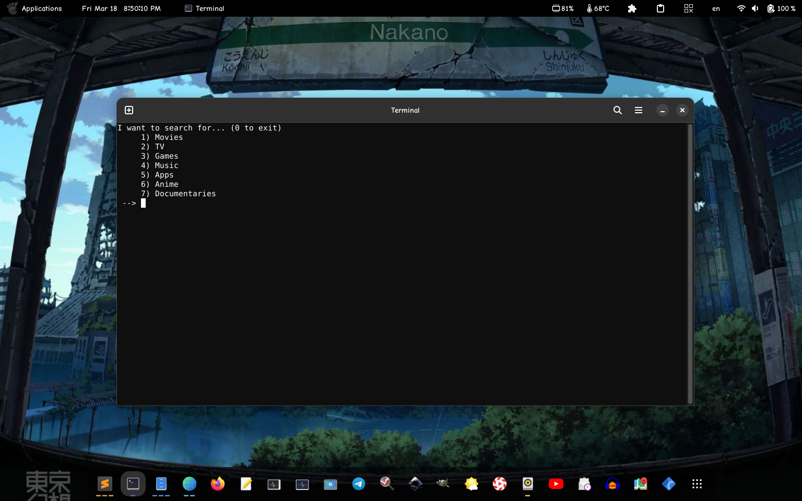
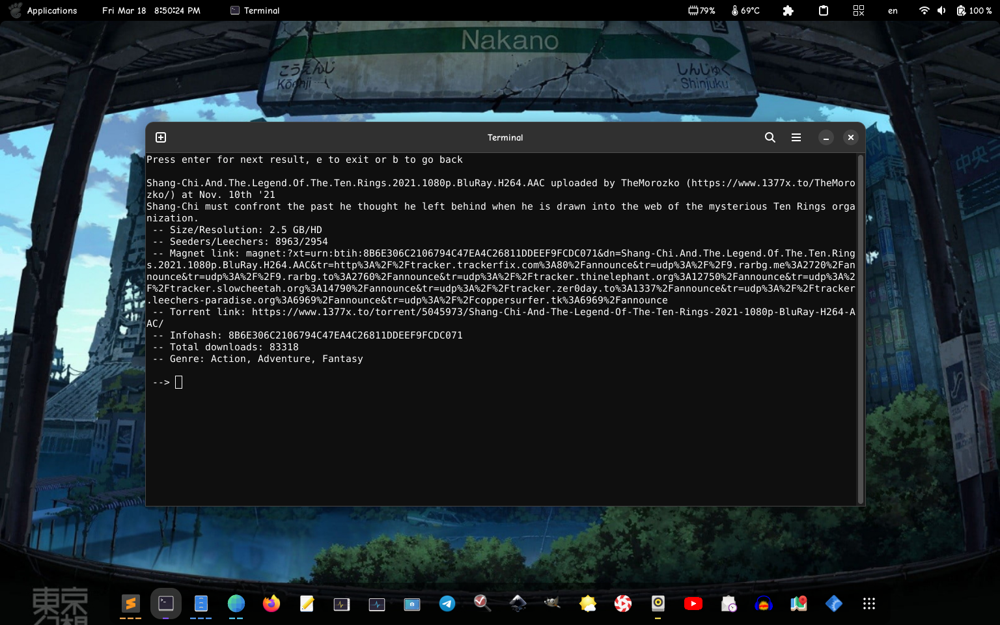
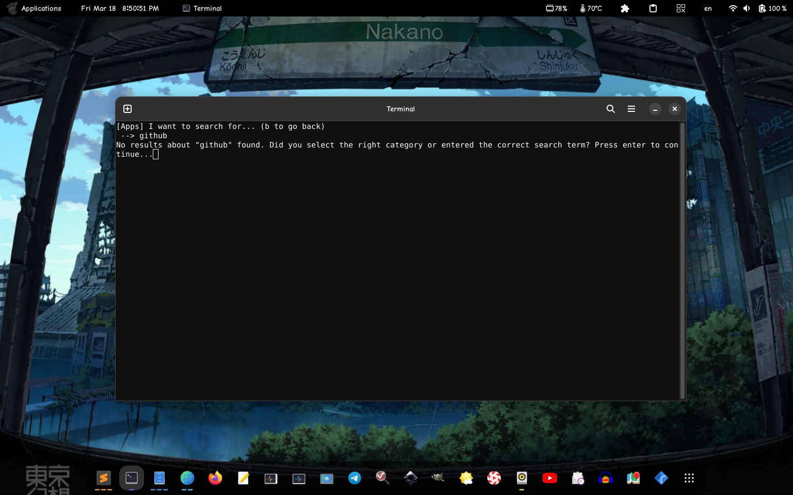

# py1337cli, a cli script made in python for 1337 website

using [1337x by hemantapkh](https://github.com/hemantapkh/1337x)'s module

## what can you search about?

+ Movies
+ TV
+ Games
+ Music
+ Apps
+ Anime
+ Documentaries

## what information can you get?

+ name of result (filename)
+ uploader name & link
+ description (if available)
+ size/resoluti0n (if available)
+ seeders/leechers (people that are providing/people downloading)
+ magnet & torrent link
+ infohash (?)
+ total downloads
+ and genre (if available)

# usage

+ git clone the repo
+ make sure you have python 3.6, and if on windows, **remove** the first line in __main.py__ file
+ make sure [the module](https://github.com/hemantapkh/1337x) is installed (pip3 install 1337x)
+ python3 main.py (or on linux chmod +x main.py && ./main.py)

---

youre free to fork and make PR's. if youre forking, **PLEASE** leave [this repos link](https://github.com/devlocalhost/py1337cli) on your readme, **AND** [hemantapkh's module repo link](https://github.com/hemantapkh/1337x). if you face any issues, **PLEASE** open an issue, or submit a PR